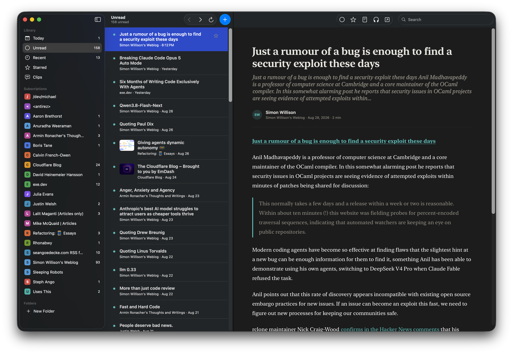

# Cove

Native Mac RSS reader that keeps what you read.

   

Feeds truncate. Blogs die. Most readers delete old articles to save space. Cove fetches the full article onto your Mac and keeps it until you delete it. Local-first, Mac-only, free while in beta.

**Download:** [Cove.dmg](https://github.com/latent-signal/covereader/releases/latest) · **Site:** [covereader.app](https://covereader.app)

## What's in the beta

- Full-text archive on this Mac, including after you unsubscribe
- Clips: saved passages that stay attached to the article
- Search that never leaves your Mac
- Read aloud with the voices already on your Mac
- Import/export subscriptions, folders included
- Apple-notarized builds, updates inside the app

Current build: v0.0.10.

## Not this (yet)

Mac only. No iPhone, no iPad, no cloud sync, no account. If you read on your phone or across several Macs, skip it for now.

This repository is the public home for releases, bugs, and feedback. Application code is not here.

## Feedback

Search existing issues first. Bugs get the bug report template. Ideas get the feature request template. Open-ended thoughts go in Discussions.
